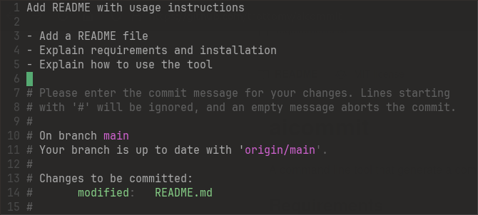

# aicommit

A command line tool that generate a commit message using the Gemini API.

## Requirements
- Python >= 3.8
- [Gemini API key](https://ai.google.dev/gemini-api/docs/api-key)
- git

## Installation

```bash
cd ~/projects
git clone https://github.com/trottomv/aicommit
```

Edit ~/.bashrc
```bash
alias aicommit='GEMINI_API_KEY=<your-api-key> python3 -m ~/aicommit/aicommit.py'
```

## Example usage

```bash
cd ~/projects/myproject
aicommit 
```


