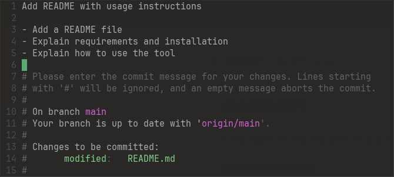

# aicommit

A command line tool that generate a commit message using the Gemini API.

## Requirements
- Python >= 3.8
- git
- astral uv
- [Gemini API key](https://ai.google.dev/gemini-api/docs/api-key)
- [Mistral API key](https://console.mistral.ai/api-keys)

## Installation

```bash
cd ~/projects
git clone https://github.com/trottomv/aicommit
```

Edit ~/.bashrc
```bash
alias aicommit='GEMINI_API_KEY=<gemini-api-key> MISTRAL_API_KEY=<mistral-api-key> uv run --no-project ~/aicommit/aicommit.py'
```

## Example usage

```bash
cd ~/projects/myproject
aicommit 
```


